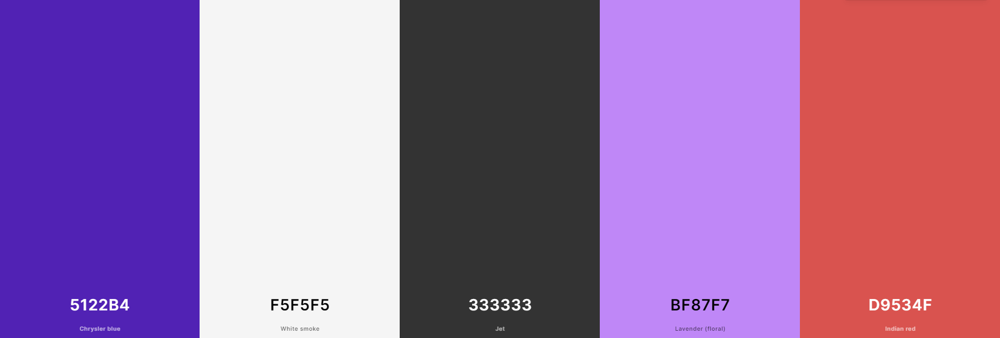

# __Tribe - Portfolio Project 4__
A social media app built with Django where users can sign up, create posts, view other people's posts, follow other users, like and comment on posts and delete their posts.

Developed by Adam Gilroy

[Live link to website](https://tribe.herokuapp.com/)

## UX

I wanted to keep the design quite simple on this site so as to not distract the user. I used the main purple colour throughout the site to establish a brand with Tribe. The off-white colour I used for my background looks well with the purple on my nav menu.

### Colour Scheme

- `#5122b4` used as the primary site colour.
- `#f5f5f5` used for the site background and button text.
- `#333333` used for the site text and footer background.
- `#b366ff` used for footer links against the dark grey colour and for the background of images on the homepage/login/sign up/logout pages.
- `#d9534f` used for the trash icon, notification icon and warning buttons.

I used [coolors.co](https://coolors.co/5122b4-f5f5f5-333333-b366ff-d9534f) to generate my colour palette.



I've used CSS `:root` variables to easily update the global colour scheme by changing only one value, instead of everywhere in the CSS file.

```css
:root {
    --main-purple: #5122b4;
    --light-purple: #b366ff;
    --accent-red: #d9534f;
    --dark-grey: #333333;
    --off-white: #f5f5f5;
}
```

### Typography

- [Fredoka One](https://fonts.google.com/specimen/Fredoka+One) was used for the site logo and header elements in the landing page, login, sign up, logout, password reset pages

- [Roboto](https://fonts.google.com/specimen/Roboto) was used for the site text

- [Font Awesome](https://fontawesome.com) icons were used throughout the site, such as the social media icons in the footer.

## User Stories

### New Site Users

- As a new site user, I would like to clearly see the site's purpose, so that I can decide whether or not to sign up.
- As a new site user, I would like to sign up for the site and create an account, so that I can create my profile and start using the site.

### Registered Users

- As a registered user, I would like to log in to my account, so that I can access the site.
- As a registered user, I would like to log out of my account, so that I can end my session on my current device.
- As a registered user, I would like to reset my password if I forget it, so that I can regain access to my account.
- As a registered user, I would like to update my profile picture and cover photo, so that I can help other users identify me.
- As a registered user, I would like to edit my profile bio, so that I can further personalize my profile.
- As a registered user, I would like to follow other users, so that I can view their posts on my feed.
- As a registered user, I would like to unfollow other users, so that I can remove their posts from my feed.
- As a registered user, I would like to create new posts, so that I can share my thoughts with my followers.
- As a registered user, I would like to delete my posts, so that I can remove content that I no longer want published.
- As a registered user, I would like to view posts from people I follow, so that I can keep up to date with them.
- As a registered user, I would like to like other people's posts, so that I can let them know I enjoyed their post.
- As a registered user, I would like to comment on other people's posts, so that I can further engage with the user and open a discussion.
- As a registered user, I would like to delete my comments on other people's posts, so that I can remove comments I no longer want published.
- As a registered user, I would like to click on a post to expand it and see likes/comments, so that I can further engage with posts.
- As a registered user, I would like to see what time and date a post was created, so that I can take in the post content in full context based on how new or old it is.
- As a registered user, I would like to search for users and posts, so that I can find content I want to see and people I want to follow.
- As a registered user, I would like to easily navigate the site, so that I can access what I need at the click of a button.
- As a registered user, I would like to message other users, so that I can communicate with them privately.
- As a registered user, I would like to delete other people's comments on my posts, so that I can remove comments I don't want on my posts.
- As a registered user, I would like to report or flag posts, so that I can notify the admins of content that might not be allowed on the site.
- As a registered user, I would like to be notified when someone follows me, interacts with my posts, or messages me, so that I can interact back with them and keep up to date with my content.
- As a registered user, I would like to like other people's comments on posts, so that I can let them know I enjoyed their comment.

### Site Admin

- As a site administrator, I should be able to delete posts and comments from any user, so that I can moderate the site's content.
- As a site administrator, I should be able to access a page only for admins to see flagged user posts, so that I can see a list of posts that possibly need to be deleted.
- As a site administrator, I should be able to unflag a post if deemed not needed for deletion, so that I can remove it from the list of flagged posts.

## Wireframes

In this section, display your wireframe screenshots using a Markdown `table`.

Instructions on how to do Markdown `tables` start on line #213 on this site: https://pandao.github.io/editor.md/en.html

To follow best practice, wireframes were developed for mobile, tablet, and desktop sizes.
I've used [Balsamiq](https://balsamiq.com/wireframes) to design my site wireframes.

### Home Page Wireframes

| Size | Screenshot |
| --- | --- |
| Mobile |  |
| Tablet |  |
| Desktop |  |

### About Page Wireframes

| Size | Screenshot |
| --- | --- |
| Mobile |  |
| Tablet |  |
| Desktop |  |

### Contact Page Wireframes

| Size | Screenshot |
| --- | --- |
| Mobile |  |
| Tablet |  |
| Desktop |  |

Repeat for any addition wireframe pages you have.

## Features

In this section, you should go over the different parts of your project,
and describe each in a sentence or so.

You will need to explain what value each of the features provides for the user,
focusing on who this website is for, what it is that they want to achieve,
and how your project is the best way to help them achieve these things.

For some/all of your features, you may choose to reference the specific project files that implement them.

IMPORTANT: Remember to always include a screenshot of each individual feature!

### Existing Features

- **Landing Page**

    - This is the page a user lands on when arriving at the site for the first time or before they've logged in if they don't have an active session. It welcomes them to the site and gives them the option to either sign up for an account or log in to an existing account.


- **Sign Up Page**

    - This is where the user can create an account for themselves by entering their e-mail address, desired username and password twice to confirm. If the user accidentally comes to this page instead of the login page they can get to the right page using the link in the card text.


- **Login Page**

    - This is where users with existing accounts can log in with either their username or e-mail and password. They can choose to let their browser remember them if they plan on returning to the site on the same device to avoid having to log in again. There's a link to the sign up page too if the user accidentally navigated to this page instead of trying to create an account. If the user forgets their password they can click the link to reset it.


- **Reset Password**

    - If a user forgets their password, they can reset it by entering the e-mail address they used to sign up. They will then receive an email with a link to set a new password.


- **Nav Menu**

    - The nav menu contains everything the user will need to navigate the site. The site logo always appears on the site menu with the other items only showing for logged in users. The menu contains an admin panel that only shows up if the logged in user is an admin. From the nav menu, user's can go to their feed, their message inbox, their profile, view their notifications if they have any, search the site for posts and users using the search bar and log out.


- **Footer**

    - The footer appears across the website and includes information about me as the developer with links to my Twitter, Linkedin and GitHub pages. This lets the user get to know me as the developer and connect on these platforms if they wish.


- **Following Feed**

    - This is the user's main feed containing posts only from users they have followed. At the top of the feed there's an area for the user to create a post. There's buttons to switch between the user's following feed and the all posts feed containing every post from every site user. Posts are displayed in chronological order from newest to oldest. If the user isn't following anyone or the people they're following has no posts, a message will appear saying "It's very quiet here..." which will prompt the user to follow more users to start seeing posts in this feed.


- **Add Post Form**

    - This is where the user will create their posts. It appears in both the following and all posts feed along with the user's own profile. There's a prompt in the form for the user to "Share with your tribe...".


- **Feed Switcher**

    - This appears on both the following feed and the all posts feed. It allows the user to switch between both feeds with ease. The feed that the user is currently viewing will have a purple background to let the user know what feed they're on.


- **All Posts Feed**

    - This feed shows every single post on the website from all users. It allows the user to find new users to follow and connect with.


- **Pagination**

    - Both following and all posts feeds as well as profiles have pagination implemented so if more than 10 posts appear in the feed then buttons appear at the bottom to split the feed into individual pages with a maximum of 10 posts on a page. This is to increase the user experience and make the site content easier to digest. If the user is on the first page of pagination then only one button will appear saying "Older Posts" and if they're on the last page then a single button will appear and say "Newer Posts" if there's more than 2 pages of posts then anything in between with contain both buttons to change between pages.


- **Posts**

    - The site wouldn't be much without user posts. Posts are found in the users feeds. From here, users can like posts, report/flag posts, see when the post was created or delete a post if they're the original author. The number of times a post has been liked is displayed next to the like button and when a user has liked a post it's filled with colour to let the user know they've already liked it. It returns to an outline if the user unlikes it.


- **Individual Posts Page**

    - When a user clicks on a post in their feed, they're brought to the individual post page. Here they have the same options as in the feed in being able to like and flag/report a post. Under the post a user can see a list of comments on the post and a form to add their own comment to the post.


- **Comments**

    - Post comments are viewed under a post and similar to posts, can be liked. Comments can be deleted by the comment author or post author and edited by the comment author.


- **Edit Comment**

    - Comments can be edited by the user that created it. Clicking the edit icon brings them to a page where they can see their comment and make changes before hitting a button to save it. There's also a button to bring them back to the post where the comment was made if they hit the edit button by mistake.


- **Profile**

    - The profile contains a card with the user's information including profile picture, background iamge, display name, username, bio, number of posts and number of followers. If the user is viewing their own profile then they'll have an icon to edit their profile. If they're viewing another user's profile then they'll have a button to follow or unfollow that user. The profile also includes a list of posts and a form to create a new post if the user is on their own profile.


- **Edit Profile**

    - This is where the user can edit their profile details including their display name, bio, profile and background pictures. The user can also remove their profile picture or background image and revert back to the default from here. There's a button to bring them back to their profile if they decide not to make any edits.


- **Follower List**

    - If the user has followers, you can click on the follower count on their profile to see a list of their followers. You can click on the profiles in the list to view them and follow them if you want.


- **Message Inbox**

    - Users can access their message inbox from the nav menu. Here a list of users they have messaged/received messages from appears. There's a button to start a new conversation if they have no threads or want to start a new one. 


- **Create Message Thread**

    - If the user clicks on the "New Conversation" button in their inbox, they will be brought to a page to create a message thread with a user. When they type a username into the form and click Continue, a new thread is created if the users haven't messaged before and they're brought to their thread if one exists already. If the user enters a username that doesn't exist then an error message pops up letting them know that the user doesn't exist.


- **Message Thread**

    - This is where users can message back and forward between each other. User messages appear on the left in purple and the person they're talking to's messages appear on the right in black. Each message contains the date and time is was sent.


- **Search**

    - Users can search people and posts on the site. If their search matches then a list of both users and posts containing their search will appear. If the search has no results in either then both lists will let the user know there was no match. If there's a user but no post matching the query then the user list will contain matching queries and the post one will let them know there's no posts for their search and the same for the opposite. The page also contains a button to bring the user back to the feed.


- **Logout**

    - When the user wants to finish their session and logout, they can do so from the nav menu. When a user clicks the logout button they're met with a page asking them to confirm they want to log out. They're redirected to the landing page if they click the confirmation button and a message pops up confirming that they've logged out.


- **Notifications**

    - Whenever a user follows someone, likes a post or comment, comments on a post, or messages someone, the other user receives a notification. The notifications tab on the nav menu shows a red dot with the number of unread notifications and when a user clicks it a dropdown will appear with a list of their notifications. If a user clicks on the notification it will bring them to the user, post, or message thread to do with the notification. If they want to remove a notification without going to the associated page, they can click the red x to delete it.


### Future Features

This is definitely a project I want to revisit in the future and add some extra features to. These features have been logged as Won't Have in my MoSCoW prioritization.

- Reshare Posts
    - I'd like to be able to add a feature that allows users to reshare other posts with their followers.
- Follow Suggestions
    - I'd like to create a section that suggests people for users to follow based on who they already follow and the posts that they interact with.
- Group Messaging
    - I'd like to add a feature that allows users to create groups for messaging and message between multiple users at once.
- Voice and Video Calling
    - I'd like to extend the messaging feature further by including voice and video calls between users.
- Private Profiles
    - I'd like to add a feature that allows a user to set their profile to private to only be viewed by followers that the user must accept.
- Dark Mode
    - I'd like to implement a feature that allows the user to change the site's colour scheme to one with a dark background with lighter text to allow the site to be viewed easily in darker settings.
- User Suspension
    - I'd like to further increase the admin's ability to moderate the website by allowing them to suspend users if they post innapropriate content. This will disable the user from posting or interacting with other users for a set amount of time or permanently for severe incidents.

## Tools & Technologies Used

In this section, you should explain the various tools and technologies used to develop the project.
Make sure to put a link (where applicable) to the source, and explain what each was used for.
Some examples have been provided, but this is just a sample only, your project might've used others.
Feel free to delete any unused items below as necessary.

- [HTML](https://en.wikipedia.org/wiki/HTML) used for the main site content.
- [CSS](https://en.wikipedia.org/wiki/CSS) used for the main site design and layout.
- [CSS :root variables](https://www.w3schools.com/css/css3_variables.asp) used for reusable styles throughout the site.
- [CSS Flexbox](https://www.w3schools.com/css/css3_flexbox.asp) and/or [CSS Grid](https://www.w3schools.com/css/css_grid.asp) used for an enhanced responsive layout.
- [Bootstrap](https://getbootstrap.com) used as the front-end CSS framework for modern responsiveness and pre-built components.
- [Materialize](https://materializecss.com) used as the front-end CSS framework for modern responsiveness and pre-built components.
- [JavaScript](https://www.javascript.com) used for user interaction on the site.
- [Python](https://www.python.org) used as the back-end programming language.
- [Git](https://git-scm.com) used for version control. (`git add`, `git commit`, `git push`)
- [GitHub](https://github.com) used for secure online code storage.
- [GitHub Pages](https://pages.github.com) used for hosting the deployed front-end site.
- [Gitpod](https://gitpod.io) used as a cloud-based IDE for development.
- [Markdown Builder by Tim Nelson](https://traveltimn.github.io/markdown-builder) used to help generate the Markdown files.
- [Flask](https://flask.palletsprojects.com) used as the Python framework for the site.
- [Django](https://www.djangoproject.com) used as the Python framework for the site.
- [MongoDB](https://www.mongodb.com) used as the non-relational database management with Flask.
- [SQLAlchemy](https://www.sqlalchemy.org) used as the relational database management with Flask.
- [PostgreSQL](https://www.postgresql.org) used as the relational database management.
- [ElephantSQL](https://www.elephantsql.com) used as the Postgres database.
- [Heroku](https://www.heroku.com) used for hosting the deployed back-end site.
- [Cloudinary](https://cloudinary.com) used for online static file storage.
- [Stripe](https://stripe.com) used for online secure payments of ecommerce products/services.
- [AWS S3](https://aws.amazon.com/s3) used for online static file storage.

## Database Design

Entity Relationship Diagrams (ERD) help to visualize database architecture before creating models.
Understanding the relationships between different tables can save time later in the project.

Using your defined models (one example below), create an ERD with the relationships identified.

```python
class Product(models.Model):
    category = models.ForeignKey(
        "Category", null=True, blank=True, on_delete=models.SET_NULL)
    sku = models.CharField(max_length=254, null=True, blank=True)
    name = models.CharField(max_length=254)
    description = models.TextField()
    has_sizes = models.BooleanField(default=False, null=True, blank=True)
    price = models.DecimalField(max_digits=6, decimal_places=2)
    rating = models.DecimalField(
        max_digits=6, decimal_places=2, null=True, blank=True)
    image_url = models.URLField(max_length=1024, null=True, blank=True)
    image = models.ImageField(null=True, blank=True)

    def __str__(self):
        return self.name
```

A couple recommendations for building free ERDs:
- [Draw.io](https://draw.io)
- [Lucidchart](https://www.lucidchart.com/pages/ER-diagram-symbols-and-meaning)


Using Markdown formatting to represent an example ERD table using the Product model above:

- Table: **Product**

    | **PK** | **id** (unique) | Type | Notes |
    | --- | --- | --- | --- |
    | **FK** | category | ForeignKey | FK to **Category** model |
    | | sku | CharField | |
    | | name | CharField | |
    | | description | TextField | |
    | | has_sizes | BooleanField | |
    | | price | DecimalField | |
    | | rating | DecimalField | |
    | | image_url | URLField | |
    | | image | ImageField | |

## Agile Development Process

### GitHub Projects

[GitHub Projects](https://github.com/adamgilroy22/tribe/projects) served as an Agile tool for this project.
It isn't a specialized tool, but with the right tags and project creation/issue assignments, it can be made to work.

Through it, user stories, issues, and milestone tasks were planned, then tracked on a weekly basis using the basic Kanban board.

Consider adding a basic screenshot of your Projects Board.


### GitHub Issues

[GitHub Issues](https://github.com/adamgilroy22/tribe/issues) served as an another Agile tool.
There, I used my own **User Story Template** to manage user stories.

It also helped with milestone iterations on a weekly basis.

Consider adding a screenshot of your Open and Closed Issues.

- [Open Issues](https://github.com/adamgilroy22/tribe/issues)

    

- [Closed Issues](https://github.com/adamgilroy22/tribe/issues?q=is%3Aissue+is%3Aclosed)

    

### MoSCoW Prioritization

I've decomposed my Epics into stories prior to prioritizing and implementing them.
Using this approach, I was able to apply the MoSCow prioritization and labels to my user stories within the Issues tab.

- **Must Have**: guaranteed to be delivered (*max 60% of stories*)
- **Should Have**: adds significant value, but not vital (*the rest ~20% of stories*)
- **Could Have**: has small impact if left out (*20% of stories*)
- **Won't Have**: not a priority for this iteration

## Testing

For all testing, please refer to the [TESTING.md](TESTING.md) file.

## Deployment

The live deployed application can be found deployed on [Heroku](https://tribe.herokuapp.com).

### ElephantSQL Database

This project uses [ElephantSQL](https://www.elephantsql.com) for the PostgreSQL Database.

To obtain your own Postgres Database, sign-up with your GitHub account, then follow these steps:
- Click **Create New Instance** to start a new database.
- Provide a name (this is commonly the name of the project: tribe).
- Select the **Tiny Turtle (Free)** plan.
- You can leave the **Tags** blank.
- Select the **Region** and **Data Center** closest to you.
- Once created, click on the new database name, where you can view the database URL and Password.

### Cloudinary API

This project uses the [Cloudinary API](https://cloudinary.com) to store media assets online, due to the fact that Heroku doesn't persist this type of data.

To obtain your own Cloudinary API key, create an account and log in.
- For *Primary interest*, you can choose *Programmable Media for image and video API*.
- Optional: *edit your assigned cloud name to something more memorable*.
- On your Cloudinary Dashboard, you can copy your **API Environment Variable**.
- Be sure to remove the `CLOUDINARY_URL=` as part of the API **value**; this is the **key**.

### Heroku Deployment

This project uses [Heroku](https://www.heroku.com), a platform as a service (PaaS) that enables developers to build, run, and operate applications entirely in the cloud.

Deployment steps are as follows, after account setup:

- Select **New** in the top-right corner of your Heroku Dashboard, and select **Create new app** from the dropdown menu.
- Your app name must be unique, and then choose a region closest to you (EU or USA), and finally, select **Create App**.
- From the new app **Settings**, click **Reveal Config Vars**, and set your environment variables.

| Key | Value |
| --- | --- |
| `CLOUDINARY_URL` | insert your own Cloudinary API key here |
| `DATABASE_URL` | insert your own ElephantSQL database URL here |
| `DISABLE_COLLECTSTATIC` | 1 (*this is temporary, and can be removed for the final deployment*) |
| `SECRET_KEY` | this can be any random secret key |

Heroku needs two additional files in order to deploy properly.
- requirements.txt
- Procfile

You can install this project's **requirements** (where applicable) using:
- `pip3 install -r requirements.txt`

If you have your own packages that have been installed, then the requirements file needs updated using:
- `pip3 freeze --local > requirements.txt`

The **Procfile** can be created with the following command:
- `echo web: gunicorn app_name.wsgi > Procfile`
- *replace **app_name** with the name of your primary Django app name; the folder where settings.py is located*

For Heroku deployment, follow these steps to connect your own GitHub repository to the newly created app:

Either:
- Select **Automatic Deployment** from the Heroku app.

Or:
- In the Terminal/CLI, connect to Heroku using this command: `heroku login -i`
- Set the remote for Heroku: `heroku git:remote -a app_name` (replace *app_name* with your app name)
- After performing the standard Git `add`, `commit`, and `push` to GitHub, you can now type:
	- `git push heroku main`

The project should now be connected and deployed to Heroku!

### Local Deployment

This project can be cloned or forked in order to make a local copy on your own system.

For either method, you will need to install any applicable packages found within the *requirements.txt* file.
- `pip3 install -r requirements.txt`.

You will need to create a new file called `env.py` at the root-level,
and include the same environment variables listed above from the Heroku deployment steps.

Sample `env.py` file:

```python
import os

os.environ.setdefault("CLOUDINARY_URL", "insert your own Cloudinary API key here")
os.environ.setdefault("DATABASE_URL", "insert your own ElephantSQL database URL here")
os.environ.setdefault("SECRET_KEY", "this can be any random secret key")

# local environment only (do not include these in production/deployment!)
os.environ.setdefault("DEBUG", "True")
```

Once the project is cloned or forked, in order to run it locally, you'll need to follow these steps:
- Start the Django app: `python3 manage.py runserver`
- Stop the app once it's loaded: `CTRL+C` or `⌘+C` (Mac)
- Make any necessary migrations: `python3 manage.py makemigrations`
- Migrate the data to the database: `python3 manage.py migrate`
- Create a superuser: `python3 manage.py createsuperuser`
- Load fixtures (if applicable): `python3 manage.py loaddata file-name.json` (repeat for each file)
- Everything should be ready now, so run the Django app again: `python3 manage.py runserver`

#### Cloning

You can clone the repository by following these steps:

1. Go to the [GitHub repository](https://github.com/adamgilroy22/tribe) 
2. Locate the Code button above the list of files and click it 
3. Select if you prefer to clone using HTTPS, SSH, or GitHub CLI and click the copy button to copy the URL to your clipboard
4. Open Git Bash or Terminal
5. Change the current working directory to the one where you want the cloned directory
6. In your IDE Terminal, type the following command to clone my repository:
	- `git clone https://github.com/adamgilroy22/tribe.git`
7. Press Enter to create your local clone.

Alternatively, if using Gitpod, you can click below to create your own workspace using this repository.

[](https://gitpod.io/#https://github.com/adamgilroy22/tribe)

Please note that in order to directly open the project in Gitpod, you need to have the browser extension installed.
A tutorial on how to do that can be found [here](https://www.gitpod.io/docs/configure/user-settings/browser-extension).

#### Forking

By forking the GitHub Repository, we make a copy of the original repository on our GitHub account to view and/or make changes without affecting the original owner's repository.
You can fork this repository by using the following steps:

1. Log in to GitHub and locate the [GitHub Repository](https://github.com/adamgilroy22/tribe)
2. At the top of the Repository (not top of page) just above the "Settings" Button on the menu, locate the "Fork" Button.
3. Once clicked, you should now have a copy of the original repository in your own GitHub account!

### Local VS Deployment

Use this space to discuss any differences between the local version you've developed, and the live deployment site on Heroku.

## Credits

In this section you need to reference where you got your content, media, and extra help from.
It is common practice to use code from other repositories and tutorials,
however, it is important to be very specific about these sources to avoid plagiarism.

### Content

Use this space to provide attribution links to any borrowed code snippets, elements, or resources.
A few examples have been provided below to give you some ideas.

Ideally, you should provide an actual link to every resource used, not just a generic link to the main site!

| Source | Location | Notes |
| --- | --- | --- |
| [Markdown Builder by Tim Nelson](https://traveltimn.github.io/markdown-builder) | README and TESTING | tool to help generate the Markdown files |
| [Chris Beams](https://chris.beams.io/posts/git-commit) | version control | "How to Write a Git Commit Message" |
| [W3Schools](https://www.w3schools.com/howto/howto_js_topnav_responsive.asp) | entire site | responsive HTML/CSS/JS navbar |
| [W3Schools](https://www.w3schools.com/howto/howto_css_modals.asp) | contact page | interactive pop-up (modal) |
| [W3Schools](https://www.w3schools.com/css/css3_variables.asp) | entire site | how to use CSS :root variables |
| [Flexbox Froggy](https://flexboxfroggy.com/) | entire site | modern responsive layouts |
| [Grid Garden](https://cssgridgarden.com) | entire site | modern responsive layouts |
| [StackOverflow](https://stackoverflow.com/a/2450976) | quiz page | Fisher-Yates/Knuth shuffle in JS |
| [YouTube](https://www.youtube.com/watch?v=YL1F4dCUlLc) | leaderboard | using `localStorage()` in JS for high scores |
| [YouTube](https://www.youtube.com/watch?v=u51Zjlnui4Y) | PP3 terminal | tutorial for adding color to the Python terminal |
| [strftime](https://strftime.org) | CRUD functionality | helpful tool to format date/time from string |
| [WhiteNoise](http://whitenoise.evans.io) | entire site | hosting static files on Heroku temporarily |

### Media

Use this space to provide attribution links to any images, videos, or audio files borrowed from online.
A few examples have been provided below to give you some ideas.

If you're the owner (or a close acquaintance) of all media files, then make sure to specify this.
Let the assessors know that you have explicit rights to use the media files within your project.

Ideally, you should provide an actual link to every media file used, not just a generic link to the main site!
The list below is by no means exhaustive. Within the Code Institute Slack community, you can find more "free media" links
by sending yourself the following command: `!freemedia`.

| Source | Location | Type | Notes |
| --- | --- | --- | --- |
| [Pexels](https://www.pexels.com) | entire site | image | favicon on all pages |
| [Lorem Picsum](https://picsum.photos) | home page | image | hero image background |
| [Unsplash](https://unsplash.com) | product page | image | sample of fake products |
| [Pixabay](https://pixabay.com) | gallery page | image | group of photos for gallery |
| [Wallhere](https://wallhere.com) | footer | image | background wallpaper image in the footer |
| [This Person Does Not Exist](https://thispersondoesnotexist.com) | testimonials | image | headshots of fake testimonial images |
| [Audio Micro](https://www.audiomicro.com/free-sound-effects) | game page | audio | free audio files to generate the game sounds |
| [Videvo](https://www.videvo.net/) | home page | video | background video on the hero section |
| [TinyPNG](https://tinypng.com) | entire site | image | tool for image compression |

### Acknowledgements

Use this space to provide attribution to any supports that helped, encouraged, or supported you throughout the development stages of this project.
A few examples have been provided below to give you some ideas.

- I would like to thank my Code Institute mentor, [John/Jane Doe](https://github.com/username) for their support throughout the development of this project.
- I would like to thank the [Code Institute](https://codeinstitute.net) tutor team for their assistance with troubleshooting and debugging some project issues.
- I would like to thank the [Code Institute Slack community](https://code-institute-room.slack.com) for the moral support; it kept me going during periods of self doubt and imposter syndrome.
- I would like to thank my spouse/partner (John/Jane), for believing in me, and allowing me to make this transition into software development.