# Testing

Return back to the [README.md](README.md) file.

## Code Validation

### HTML

I have used the recommended [HTML W3C Validator](https://validator.w3.org) to validate all of my HTML files.

As my project uses Jinja syntax, such as ``, ``, and `{{ variable|filter }}`
it will not validate properly if I copy and paste into the HTML validator straight from my source files.

Usually in order to properly validate these types of files, it's recommended to
[validate by uri](https://validator.w3.org/#validate_by_uri) from the deployed Heroku pages.

Unfortunately, nearly all of the pages on this site require a user to be logged-in and authenticated,
and will not work using this method, due to the fact that the HTML Validator (W3C) doesn't have
access to login to the pages.

In order to properly validate my HTML pages with Jinja syntax for authenticated pages, I followed these steps:

- Navigate to the deployed pages which require authentication
- Right-click anywhere on the page, and select **View Page Source** (usually `CTRL+U` or `⌘+U` on Mac).
- This will display the entire "compiled" code, without any Jinja syntax.
- Copy everything, and use the [validate by input](https://validator.w3.org/#validate_by_input) method.
- Repeat this process for every page that requires a user to be logged-in/authenticated.

| Page | W3C URL | Screenshot | Notes |
| --- | --- | --- | --- |
| Home | [W3C](https://validator.w3.org/nu/?doc=https%3A%2F%2Ftribe.herokuapp.com%2F) |  | Pass: No Errors |
| Sign Up | [W3C](https://validator.w3.org/nu/?doc=https%3A%2F%2Ftribe.herokuapp.com%2Faccounts%2Fsignup%2F) |  | Pass: No Errors |
| Log In | [W3C](https://validator.w3.org/nu/?doc=https%3A%2F%2Ftribe.herokuapp.com%2Faccounts%2Flogin%2F) |  | Pass: No Errors |
| Forgot Password | [W3C](https://validator.w3.org/nu/?doc=https%3A%2F%2Ftribe.herokuapp.com%2Faccounts%2Fpassword%2Freset%2F) |  | Pass: No Errors |
| Following Feed | n/a |  | Pass: No Errors |
| All Posts Feed | n/a |  | Pass: No Errors |
| Messaging Inbox | n/a |  | Pass: No Errors |
| Messaging Thread | n/a |  | Pass: No Errors |
| Create Thread | n/a |  | Pass: No Errors |
| User Profile | n/a |  | Pass: No Errors |
| Other Profile | n/a |  | Pass: No Errors |
| Edit Profile | n/a |  | Pass: No Errors |
| Followers List | n/a |  | Pass: No Errors |
| Individual Post | n/a |  | Pass: No Errors |
| Delete Post | n/a |  | Pass: No Errors |
| Edit Comment | n/a |  | Pass: No Errors |
| Delete Comment | n/a |  | Pass: No Errors |
| Admin Panel | n/a |  | Pass: No Errors |
| Search | n/a |  | Pass: No Errors |
| Sign Out | n/a |  | Pass: No Errors |

### CSS

I have used the recommended [CSS Jigsaw Validator](https://jigsaw.w3.org/css-validator) to validate my CSS file. On the first test, the validator threw an issue on line 231 of my CSS file saying that 0.3s is not a transform value. This alerted me to a typo in my CSS where I should have put transition instead of transform. I fixed this error and on my second validation test, no errors were thrown.

| File | Jigsaw URL | Screenshot | Notes |
| --- | --- | --- | --- |
| style.css | [Jigsaw](https://jigsaw.w3.org/css-validator/validator?uri=https%3A%2F%2Ftribe.herokuapp.com%2F&profile=css3svg&usermedium=all&warning=1&vextwarning=&lang=en) |  | Fail: 0.3s is not a transform value |
| style.css | [Jigsaw](https://jigsaw.w3.org/css-validator/validator?uri=https%3A%2F%2Ftribe.herokuapp.com%2F&profile=css3svg&usermedium=all&warning=1&vextwarning=&lang=en) |  | Pass: No Errors |

### JavaScript

I have used the recommended [JShint Validator](https://jshint.com) to validate all of my JS files.

| File | Screenshot | Notes |
| --- | --- | --- |
| message.js |  | Undefined variable Bootstrap |
| notifications.js |  | Unused variables showNotification removeNotification (Used in notifications.html) |

### Python

I have used the recommended [CI Python Linter](https://pep8ci.herokuapp.com) to validate all of my Python files.

| File | CI URL | Screenshot | Notes |
| --- | --- | --- | --- |
| settings.py | [CI PEP8](https://pep8ci.herokuapp.com/https://raw.githubusercontent.com/adamgilroy22/tribe/main/tribe/settings.py) |  | Pass: No Errors |
| urls.py (main) | [CI PEP8](https://pep8ci.herokuapp.com/https://raw.githubusercontent.com/adamgilroy22/tribe/main/tribe/urls.py) |  | Pass: No Errors |
| forms.py (comments) | [CI PEP8](https://pep8ci.herokuapp.com/https://raw.githubusercontent.com/adamgilroy22/tribe/main/comments/forms.py) |  | Pass: No Errors |
| models.py (comments) | [CI PEP8](https://pep8ci.herokuapp.com/https://raw.githubusercontent.com/adamgilroy22/tribe/main/comments/models.py) |  | Pass: No Errors |
| urls.py (home) | [CI PEP8](https://pep8ci.herokuapp.com/https://raw.githubusercontent.com/adamgilroy22/tribe/main/home/urls.py) |  | Pass: No Errors |
| views.py (home) | [CI PEP8](https://pep8ci.herokuapp.com/https://raw.githubusercontent.com/adamgilroy22/tribe/main/home/views.py) |  | Pass: No Errors |
| forms.py (messaging) | [CI PEP8](https://pep8ci.herokuapp.com/https://raw.githubusercontent.com/adamgilroy22/tribe/main/messaging/forms.py) |  | Pass: No Errors |
| models.py (messaging) | [CI PEP8](https://pep8ci.herokuapp.com/https://raw.githubusercontent.com/adamgilroy22/tribe/main/messaging/models.py) |  | Pass: No Errors |
| urls.py (messaging) | [CI PEP8](https://pep8ci.herokuapp.com/https://raw.githubusercontent.com/adamgilroy22/tribe/main/messaging/urls.py) |  | Pass: No Errors |
| views.py (messaging) | [CI PEP8](https://pep8ci.herokuapp.com/https://raw.githubusercontent.com/adamgilroy22/tribe/main/messaging/views.py) |  | Pass: No Errors |
| models.py (notifications) | [CI PEP8](https://pep8ci.herokuapp.com/https://raw.githubusercontent.com/adamgilroy22/tribe/main/notifications/models.py) |  | Pass: No Errors |
| urls.py (notifications) | [CI PEP8](https://pep8ci.herokuapp.com/https://raw.githubusercontent.com/adamgilroy22/tribe/main/notifications/urls.py) |  | Pass: No Errors |
| views.py (notifications) | [CI PEP8](https://pep8ci.herokuapp.com/https://raw.githubusercontent.com/adamgilroy22/tribe/main/notifications/views.py) |  | Pass: No Errors |
| forms.py (posts) | [CI PEP8](https://pep8ci.herokuapp.com/https://raw.githubusercontent.com/adamgilroy22/tribe/main/posts/forms.py) |  | Pass: No Errors |
| models.py (posts) | [CI PEP8](https://pep8ci.herokuapp.com/https://raw.githubusercontent.com/adamgilroy22/tribe/main/posts/models.py) |  | Pass: No Errors |
| urls.py (posts) | [CI PEP8](https://pep8ci.herokuapp.com/https://raw.githubusercontent.com/adamgilroy22/tribe/main/posts/urls.py) |  | Pass: No Errors |
| views.py (posts) | [CI PEP8](https://pep8ci.herokuapp.com/https://raw.githubusercontent.com/adamgilroy22/tribe/main/posts/views.py) |  | Pass: No Errors |
| models.py (profiles) | [CI PEP8](https://pep8ci.herokuapp.com/https://raw.githubusercontent.com/adamgilroy22/tribe/main/profiles/models.py) |  | Pass: No Errors |
| urls.py (profiles) | [CI PEP8](https://pep8ci.herokuapp.com/https://raw.githubusercontent.com/adamgilroy22/tribe/main/profiles/urls.py) |  | Pass: No Errors |
| views.py (profiles) | [CI PEP8](https://pep8ci.herokuapp.com/https://raw.githubusercontent.com/adamgilroy22/tribe/main/profiles/views.py) |  | Pass: No Errors |
| urls.py (search) | [CI PEP8](https://pep8ci.herokuapp.com/https://raw.githubusercontent.com/adamgilroy22/tribe/main/search/urls.py) |  | Pass: No Errors |
| views.py (search) | [CI PEP8](https://pep8ci.herokuapp.com/https://raw.githubusercontent.com/adamgilroy22/tribe/main/search/views.py) |  | Pass: No Errors |


## Browser Compatibility

I've tested my deployed project on multiple browsers to check for compatibility issues.

| Browser | Screenshot | Notes |
| --- | --- | --- |
| Chrome |  | Works as expected |
| Firefox |  | Works as expected |
| Edge |  | Works as expected |

## Responsiveness

I've tested my deployed project on multiple devices to check for responsiveness issues.

| Device | Screenshot | Notes |
| --- | --- | --- |
| Mobile (DevTools) |   | Works as expected |
| Tablet (DevTools) |   | Works as expected |
| Laptop |  | Works as expected |
| Desktop |  | Works as expected |

## Lighthouse Audit

I've tested my deployed project using the Lighthouse Audit tool to check for any major issues.

| Page | Size | Screenshot | Notes |
| --- | --- | --- | --- |
| Home | Desktop |  | No major warnings |
| Home | Mobile |  | Some minor warnings |
| Sign Up | Desktop |  | No major warnings |
| Sign Up | Mobile |  | Some minor warnings |
| Sign In | Desktop |  | No major warnings |
| Sign In | Mobile |  | Some minor warnings |
| Forgot Password | Desktop |  | No major warnings |
| Forgot Password | Mobile |  | Some minor warnings |
| Following Feed | Desktop |  | No major warnings |
| Following Feed | Mobile |  | No major warnings |
| All Posts Feed | Desktop |  | No major warnings |
| All Posts Feed | Mobile | 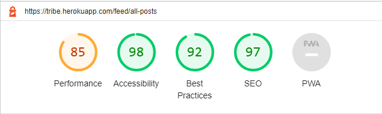 | Some minor warnings |
| Messages Inbox | Desktop |  | No major warnings |
| Messages Inbox | Mobile | 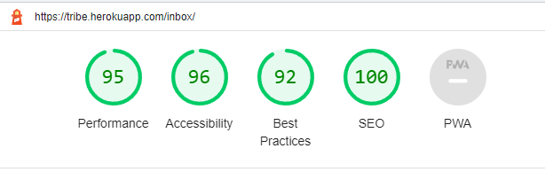 | No major warnings |
| Messages Thread | Desktop |  | No major warnings |
| Messages Thread | Mobile |  | Some minor warnings |
| Create Thread | Desktop |  | No major warnings |
| Create Thread | Mobile |  | No major warnings |
| User Profile | Desktop |  | Some warnings - image sizes |
| User Profile | Mobile |  | No major warnings |
| Other Profile | Desktop |  | No major warnings |
| Other Profile | Mobile |  | Some warnings - image sizes |
| Admin Panel | Desktop |  | No major warnings |
| Admin Panel | Mobile |  | No major warnings |
| Search | Desktop |  | No major warnings |
| Search | Mobile |  | No major warnings |
| Sign Out | Desktop |  | No major warnings |
| Sign Out | Mobile |  | Some minor warnings |

## Defensive Programming

Defensive programming was manually tested with the below user acceptance testing:

| Page | User Action | Expected Result | Pass/Fail | Comments |
| --- | --- | --- | --- | --- |
| **Home Page** | | | | |
| | Click on Logo | Redirection to Home page | Pass | |
| **Sign Up** | | | | |
| | Click on Sign Up button on home page | Redirection to Sign Up page | Pass | |
| | Enter valid email address | Field will only accept email address format | Pass | |
| | Enter valid password (twice) | Field will only accept password format | Pass | |
| | Click Sign Up button on sign up page | Redirects user to feed | Pass | |
| **Log In** | | | | |
| | Click on the Login button on home page | Redirection to Login page | Pass | |
| | Enter valid email address | Field will only accept email address format | Pass | |
| | Enter valid password | Field will only accept password format | Pass | |
| | Click Login button on login page | Redirects user to feed | Pass | |
| | Click Forgot Password | Redirects user to password reset page | Pass | |
| **Password Reset** | | | | |
| | Enter valid email address | Field will only accept email address format | Pass | |
| | Click Reset Password button | Sends email with instructions to reset password | Pass | |
| **Log Out** | | | | |
| | Click Logout button | Redirects user to logout page | Pass | Confirms logout first |
| | Click Confirm Logout button | Redirects user to home page | Pass | |
| **Own Profile** | | | | |
| | Click on Profile button in nav | User will be redirected to their Profile page | Pass | |
| | Click on the Edit icon | User will be redirected to the edit profile page | Pass | |
| | Click on the Back To Feed button | User will be redirected to their feed | Pass | |
| | Click on followers | User will be redirected to followers list page | Pass | |
| | Click on a post | User will be redirected to the individual post page | Pass | |
| | Click delete icon on own post | User is redirected to post delete confirmation page | Pass | |
| | Type text into the add a post form and click send | New post is created by the user | Pass | |
| | Click send on new post form without adding content | User is prompted to enter something into the field before sending | Pass | |
| **Other Profile** | | | | |
| | Click on the follow button | User will follow current profile they're on and button will change to say unfollow | Pass | Profile owner receives a notification letting them know someone has followed them and followers count will increase by 1 |
| | Click on the unfollow button | User will unfollow current profile they're on and button will change to say follow | Pass | Followers count will decrease by 1 |
| | Click on the Back To Feed button | User will be redirected to their feed | Pass | |
| | Click on followers | User will be redirected to followers list page | Pass | |
| | Brute forcing the URL to edit another user's profile | User should be given an error | Pass | Redirects user to error page |
| | Click on a post | User will be redirected to the individual post page | Pass | |
| **Following Feed** | | | | |
| | Click on a post | User will be redirected to the individual post page | Pass | |
| | Click on the username on a post | User will be redirected to the post author's profile | Pass | |
| | Click the like button on a post | Like button will fill with colour and the like count will increase by 1 | Pass | Post author receives a notification letting them know someone has liked their post |
| | Click the like button on a post already liked by the user | Like button will become clear in the middle like count will decrease by 1 | Pass | |
| | Click flag button | Message appears telling the user the post has been reported | Pass | Post is added to the Admin Panel page for admins to review |
| | Type text into the add a post form and click send | New post is created by the user | Pass | |
| | Click send on new post form without adding content | User is prompted to enter something into the field before sending | Pass | |
| | Click delete icon on own post | User is redirected to post delete confirmation page | Pass | |
| | Brute forcing the URL to delete another user's post | User should be given an error | Pass | Redirects user to error page |
| | Click All Posts button | User is redirected to feed containing all posts from every user on the website | Pass | |
| **All Posts Feed** | | | | |
| | Click on a post | User will be redirected to the individual post page | Pass | |
| | Click on the username on a post | User will be redirected to the post author's profile | Pass | |
| | Click the like button on a post | Like button will fill with colour and the like count will increase by 1 | Pass | Post author receives a notification letting them know someone has liked their post |
| | Click the like button on a post already liked by the user | Like button will become clear in the middle like count will decrease by 1 | Pass | |
| | Click flag button | Message appears telling the user the post has been reported | Pass | Post is added to the Admin Panel page for admins to review |
| | Type text into the add a post form and click send | New post is created by the user | Pass | |
| | Click send on new post form without adding content | User is prompted to enter something into the field before sending | Pass | |
| | Click delete icon on own post | User is redirected to post delete confirmation page | Pass | |
| | Brute forcing the URL to delete another user's post | User should be given an error | Pass | Redirects user to error page |
| | Click Following button | User is redirected to feed containing posts only from users they have followed | Pass | |
| **Individual Post Page** | | | | |
| | Click on the username on the post | User will be redirected to the post author's profile | Pass | |
| | Click on the Back To Feed button | User will be redirected to their feed | Pass | |
| | Click the like button on the post | Like button will fill with colour and the like count will increase by 1 | Pass | Post author receives a notification letting them know someone has liked their post |
| | Click the like button on the post if already liked by the user | Like button will become clear in the middle like count will decrease by 1 | Pass | |
| | Click flag button | Message appears telling the user the post has been reported | Pass | Post is added to the Admin Panel page for admins to review |
| | Click delete icon on own post | User is redirected to post delete confirmation page | Pass | |
| | Brute forcing the URL to delete another user's post | User should be given an error | Pass | Redirects user to error page |
| | Type text into Leave Your Reply form and click Send | Comment is created under current post | Pass | Post author will receive a notification to tell them they have a new comment on their post |
| **Delete Post Page** | | | | |
| | Click on the Delete button | Post will be permanently deleted | Pass | |
| | Click on the Back To Post button | User will be redirected to the original post | Pass | |
| **Comments** | | | | |
| | Click on the username on a comment | User will be redirected to the comment author's profile | Pass | |
| | Click the like button on a comment | Like button will fill with colour and the like count will increase by 1 | Pass | Comment author receives a notification letting them know someone has liked their comment |
| | Click the like button on the comment if already liked by the user | Like button will become clear in the middle like count will decrease by 1 | Pass | |
| | Click delete icon on own comment or comment on own post | User is redirected to comment delete confirmation page | Pass | |
| | Brute forcing the URL to delete another user's comment if not on your post | User should be given an error | Pass | Redirects user to error page |
| | Click edit icon on own comment | User is redirected to comment edit page | Pass | |
| | Brute forcing the URL to edit another user's comment | User should be given an error | Pass | Redirects user to error page |
| **Delete Comment Page** | | | | |
| | Click on the Delete button | Comment will be permanently deleted | Pass | |
| | Click on the Back To Post button | User will be redirected to the original post | Pass | |
| **Edit Comment Page** | | | | |
| | Fill in comment form and click submit | Original comment will be edited | Pass | |
| | Click on the Back To Post button | User will be redirected to the original post | Pass | |
| **Error Page** | | | | |
| | Click on Back To Your Tribe button | User will be redirected to their feed | Pass | |
| **Inbox** | | | | |
| | Click on Messages button in nav | User will be redirected to their inbox | Pass | |
| | Click on New Conversation button | User will be redirected to the create message thread page | Pass | |
| | Click on any previos message threads | User will be redirected to relevant thread | Pass | |
| **Create Thread** | | | | |
| | Type valid username into form and click continue | User will be redirected message thread with username they typed | Pass | If a thread already exists, they will be brought to that and if not a new thread will be created between the two users |
| | Type an invalid username into form and click continue | Message will appear letting user know that username doesn't exist | Pass | |
| | Click continue without entering anything into form | User will be asked to enter something into the form before continuing | Pass | |
| | Click Back to Inbox button | User will be redirected to their inbox | Pass | |
| **Message Thread** | | | | |
| | Type text into form and click Send Message | Content in form will be sent to the other user as a message | Pass | Other user will receive a notification to tell them they have a new message |
| | Click on other user's name | User will be redirected to other user's profile | Pass | |
| **Search Page** | | | | |
| | Type text into search form into nav and click the search icon | User is directed to a page with a list of both users and posts containing their search query | Pass | If there are no users and/or posts containing the query the page will let the user know there was no results in either or both for their query |
| | Click on user's name in either user or post list | User will be redirected to other user's profile | Pass | |
| **Notifications** | | | | |
| | Click on Notifications button in nav when there's no notifications | Nothing should happen | Pass | |
| | Click on Notifications button in nav when there is notifications | A dropdown showing notifications should appear | Pass | |
| | Click on new message notification | User will be redirected to relevant thread | Pass | Notification is deleted from list after being clicked on |
| | Click on new post like notification | User will be redirected to their post that was liked | Pass | Notification is deleted from list after being clicked on |
| | Click on new post comment notification | User will be redirected to their post that was commented on | Pass | Notification is deleted from list after being clicked on |
| | Click on new comment like notification | User will be redirected to the post that their comment was liked on | Pass | Notification is deleted from list after being clicked on |
| | Click on X next to notification | Notification will be removed from notifications list | Pass | |
| **Admin Panel** | | | | |
| | Click on Admin Panel button in nav | User will be redirected to the Admin Panel page with a list of flagged posts | Pass | Admin Panel button only appears on the nav if the logged in user is an admin |
| | Brute forcing the URL to access Admin Panel as a regular user | User should be given an error | Pass | Redirects user to error page |
| | Click delete icon on post in list | User is redirected to post delete confirmation page | Pass | Admin's are able to delete any post on the site regardless of if they are the author or not |
| | Click flag button | Message appears telling the user the post has been unflagged and the post is removed from the admin panel page | Pass | Only admins can unflag a post, if a regular user clicks the flag on an already reported post they will get the post flagged message but nothing else will happen as the post will already be in the admin panel |
| | Click on user's name on post | User will be redirected to other user's profile | Pass | |

## User Story Testing

| User Story | Screenshot |
| --- | --- |
| As a new site user, I would like to clearly see the site's purpose, so that I can decide whether or not to sign up. | 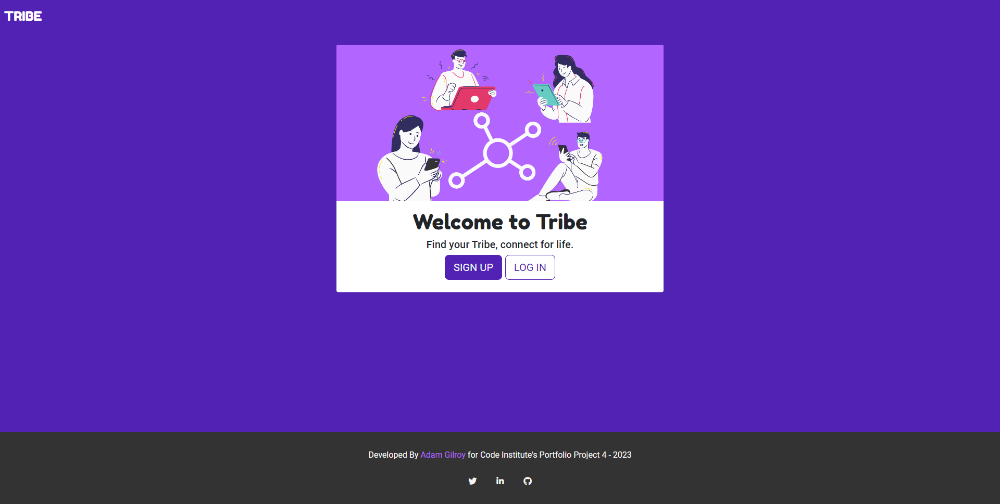 |
| As a new site user, I would like to sign up for the site and create an account, so that I can create my profile and start using the site. |  |
| As a registered user, I would like to log in to my account, so that I can access the site. |  |
| As a registered user, I would like to log out of my account, so that I can end my session on my current device. | 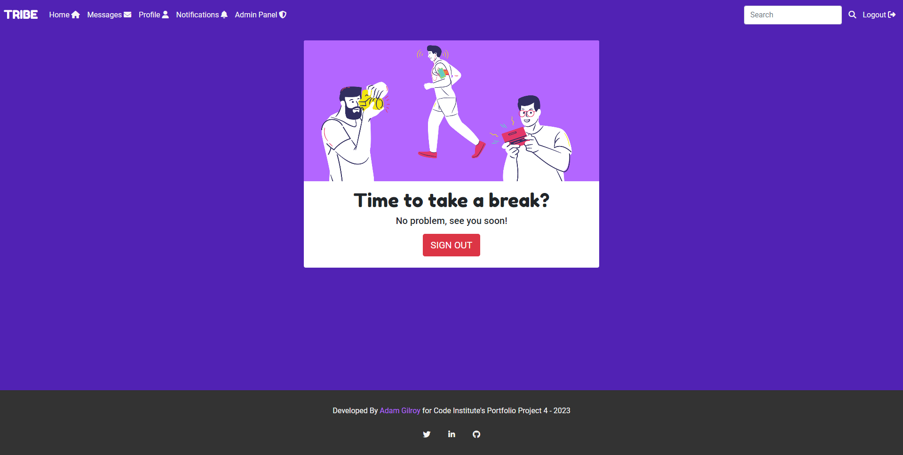 |
| As a registered user, I would like to reset my password if I forget it, so that I can regain access to my account. | 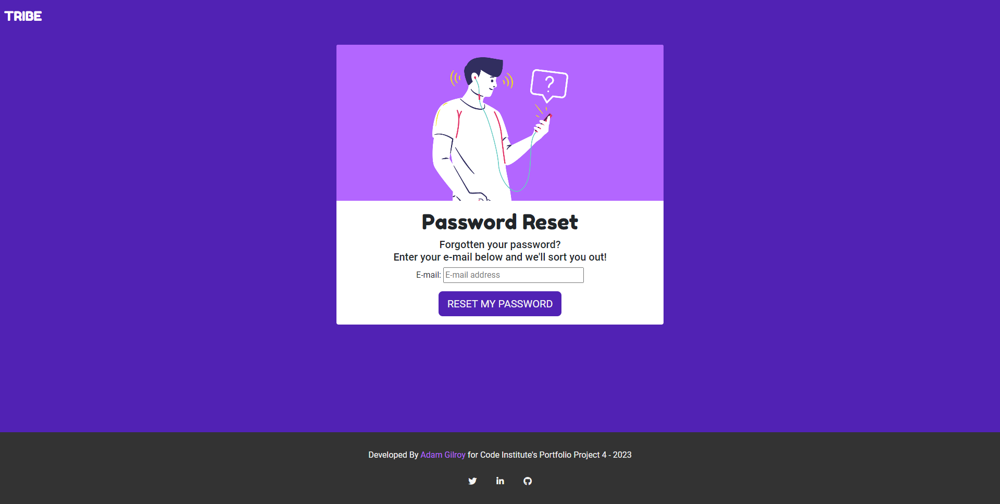 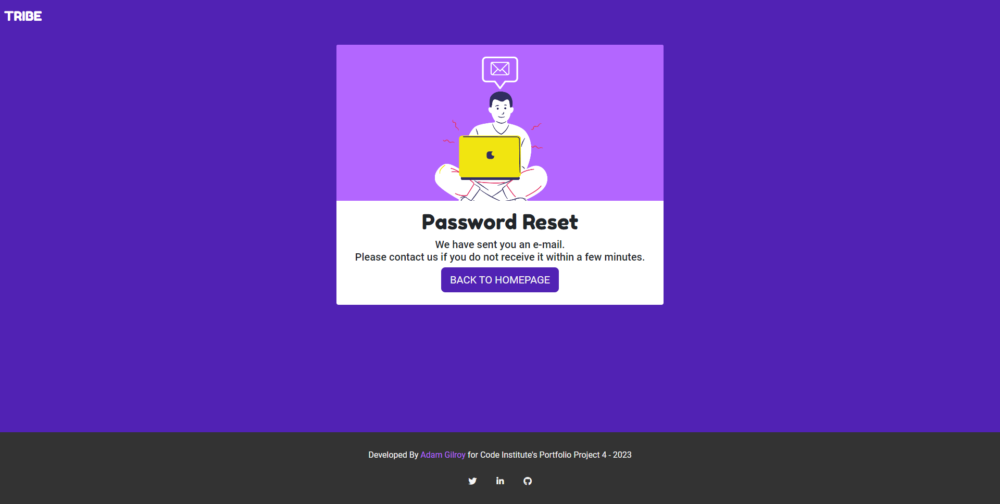 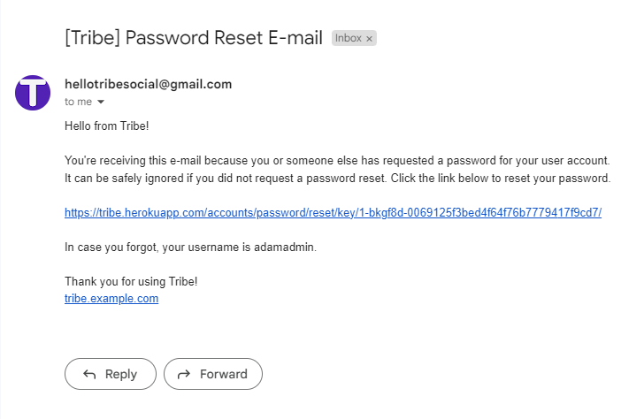 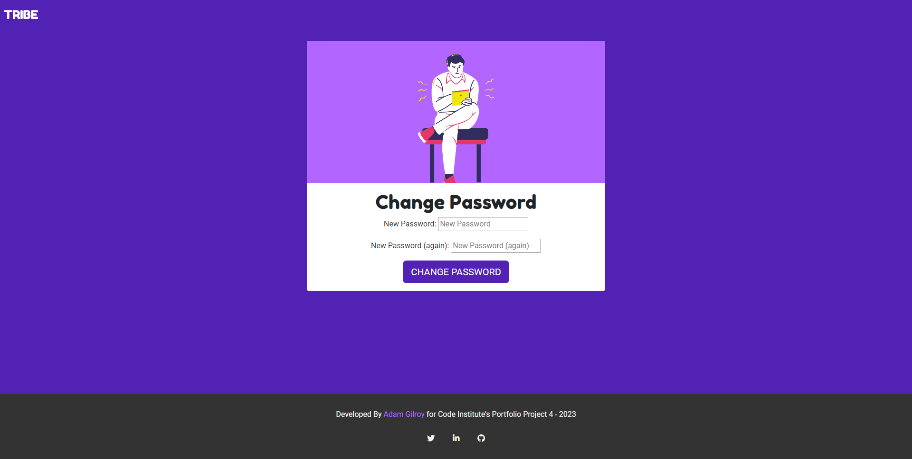 |
| As a registered user, I would like to update my profile picture and cover photo, so that I can help other users identify me. | 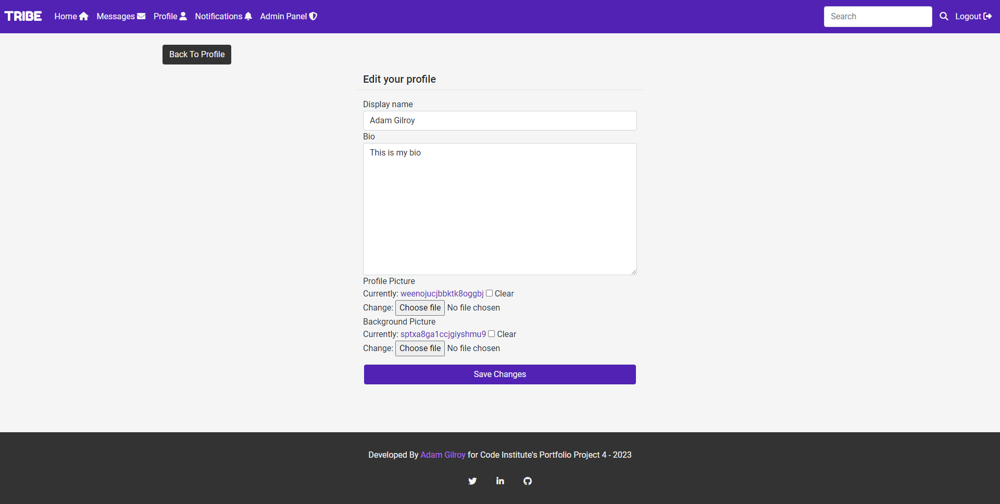 |
| As a registered user, I would like to edit my profile bio, so that I can further personalize my profile. |  |
| As a registered user, I would like to follow other users, so that I can view their posts on my feed. |  |
| As a registered user, I would like to unfollow other users, so that I can remove their posts from my feed. |  |
| As a registered user, I would like to create new posts, so that I can share my thoughts with my followers. | 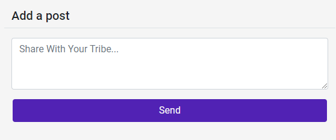 |
| As a registered user, I would like to delete my posts, so that I can remove content that I no longer want published. | 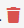 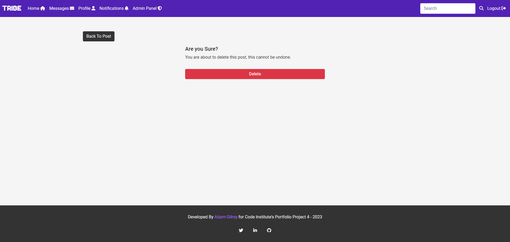 |
| As a registered user, I would like to view posts from people I follow, so that I can keep up to date with them. | 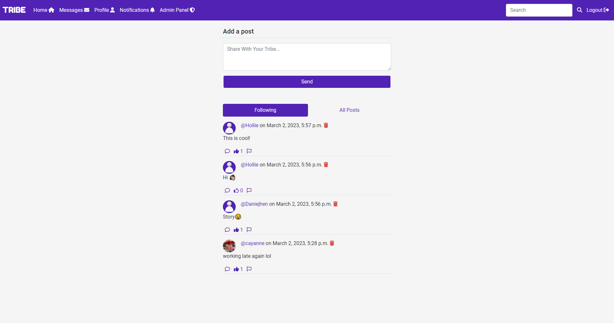 |
| As a registered user, I would like to like other people's posts, so that I can let them know I enjoyed their post. | 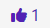 |
| As a registered user, I would like to comment on other people's posts, so that I can further engage with the user and open a discussion. | 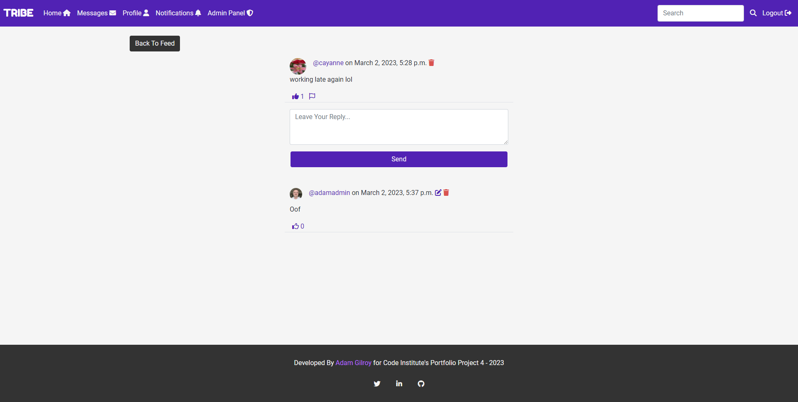 |
| As a registered user, I would like to delete my comments on other people's posts, so that I can remove comments I no longer want published. | 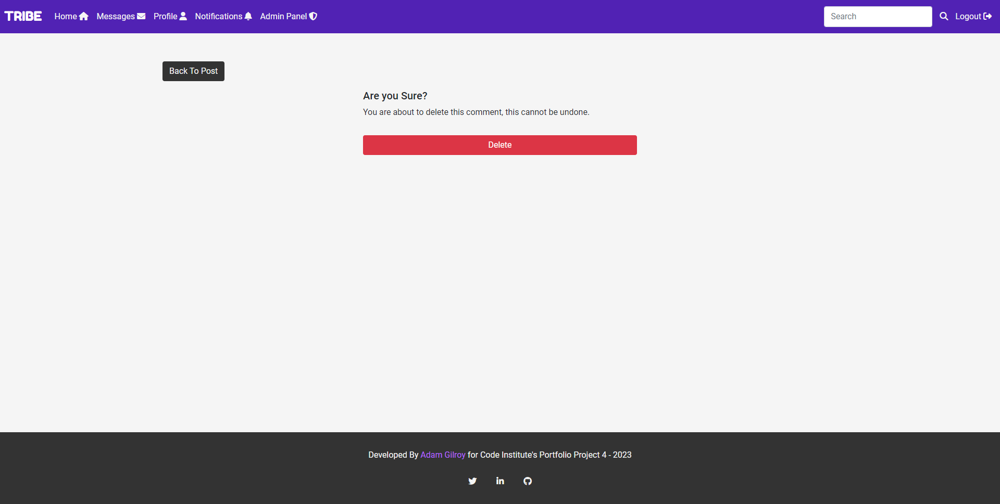 |
| As a registered user, I would like to click on a post to expand it and see the psot comments, so that I can further engage with posts. |  |
| As a registered user, I would like to see what time and date a post was created, so that I can take in the post content in full context based on how new or old it is. | 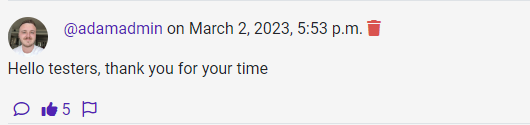 |
| As a registered user, I would like to search for users and posts, so that I can find content I want to see and people I want to follow. | 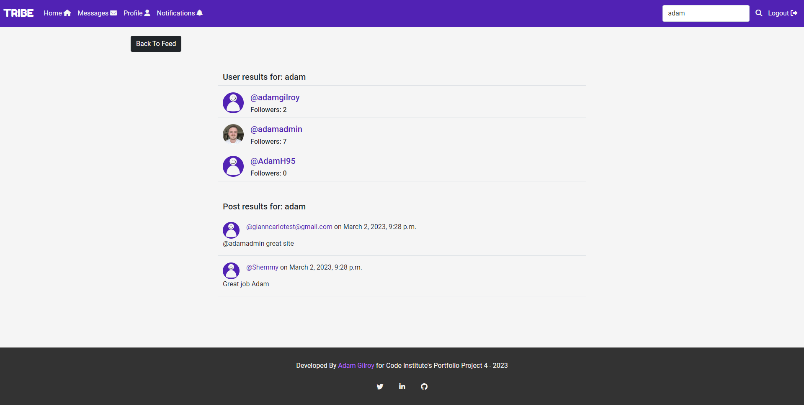 |
| As a registered user, I would like to easily navigate the site, so that I can access what I need at the click of a button. | 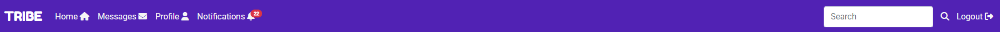 |
| As a registered user, I would like to message other users, so that I can communicate with them privately. | 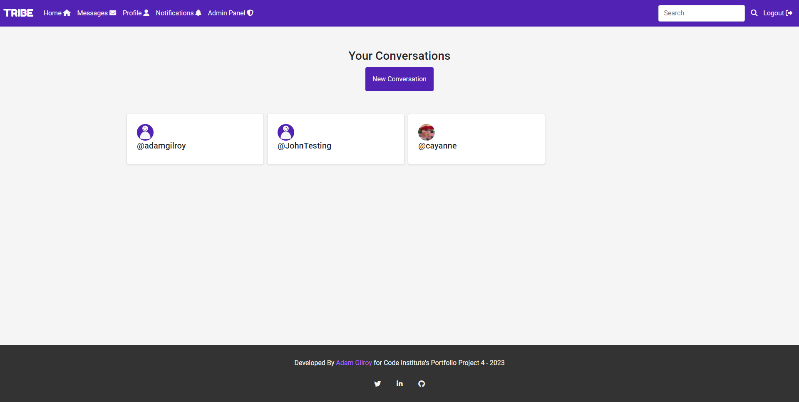 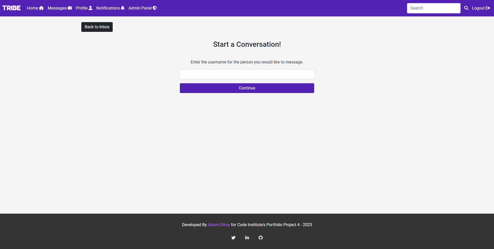 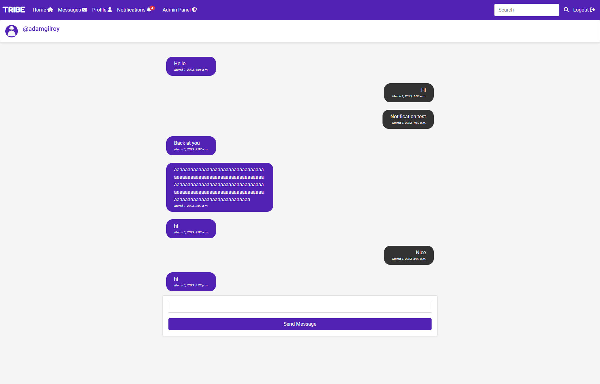 |
| As a registered user, I would like to delete other people's comments on my posts, so that I can remove comments I don't want on my posts. |  |
| As a registered user, I would like to report or flag posts, so that I can notify the admins of content that might not be allowed on the site. | 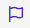 |
| As a registered user, I would like to be notified when someone follows me, interacts with my posts, or messages me, so that I can interact back with them and keep up to date with my content. | 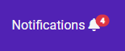 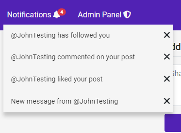 |
| As a registered user, I would like to like other people's comments on posts, so that I can let them know I enjoyed their comment. |  |
| As a site administrator, I should be able to delete posts and comments from any user, so that I can moderate the site's content. |    |
| As a site administrator, I should be able to access a page only for admins to see flagged user posts, so that I can see a list of posts that possibly need to be deleted. | 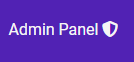  |
| As a site administrator, I should be able to unflag a post if deemed not needed for deletion, so that I can remove it from the list of flagged posts. |   |

## Automated Testing

I have conducted a series of automated tests on my application.

I fully acknowledge and understand that, in a real-world scenario, an extensive set of additional tests would be more comprehensive.

### JavaScript (Jest Testing)

I have used the [Jest](https://jestjs.io) JavaScript testing framework to test the application functionality.

In order to work with Jest, I first had to initialize NPM.

- `npm init`
- Hit `enter` for all options, except for **test command:**, just type `jest`.

Add Jest to a list called **Dev Dependencies** in a dev environment:

- `npm install --save-dev jest`

**IMPORTANT**: Initial configurations

When creating test files, the name of the file needs to be `file-name.test.js` in order for Jest to properly work.

Due to a change in Jest's default configuration, you'll need to add the following code to the top of the `.test.js` file:

```js
/**
 * @jest-environment jsdom
 */

const { test, expect } = require("@jest/globals");
const { function1, function2, function3, etc. } = require("../script-name");

beforeAll(() => {
    let fs = require("fs");
    let fileContents = fs.readFileSync("index.html", "utf-8");
    document.open();
    document.write(fileContents);
    document.close();
});
```

Remember to adjust the `fs.readFileSync()` to the specific file you'd like you test.
The example above is testing the `index.html` file.

Finally, at the bottom of the script file where your primary scripts are written, include the following at the bottom of the file.
Make sure to include the name of all of your functions that are being tested in the `.test.js` file.

```js
if (typeof module !== "undefined") module.exports = {
    function1, function2, function3, etc.
};
```

Now that these steps have been undertaken, further tests can be written, and be expected to fail initially.
Write JS code that can get the tests to pass as part of the Red-Green refactor process.

Once ready, to run the tests, use this command:

- `npm test`

**NOTE**: To obtain a coverage report, use the following command:

- `npm test --coverage`

Below are the results from the tests that I've written for this application:

| Test Suites | Tests | Coverage | Screenshot |
| --- | --- | --- | --- |
| 1 passed | 16 passed | 55% |  |
| x | x | x | repeat for all remaining tests |

#### Jest Test Issues

Use this section to list any known issues you ran into while writing your Jest tests.
Remember to include screenshots (where possible), and a solution to the issue (if known).

This can be used for both "fixed" and "unresolved" issues.

### Python (Unit Testing)

I have used Django's built-in unit testing framework to test the application functionality.

In order to run the tests, I ran the following command in the terminal each time:

`python3 manage.py test name-of-app `

To create the coverage report, I would then run the following commands:

`coverage run --source=name-of-app manage.py test`

`coverage report`

To see the HTML version of the reports, and find out whether some pieces of code were missing, I ran the following commands:

`coverage html`

`python3 -m http.server`

Below are the results from the various apps on my application that I've tested:

| App | File | Coverage | Screenshot |
| --- | --- | --- | --- |
| Bag | test_forms.py | 99% |  |
| Bag | test_models.py | 89% |  |
| Bag | test_urls.py | 100% |  |
| Bag | test_views.py | 71% |  |
| Checkout | test_forms.py | 99% |  |
| Checkout | test_models.py | 89% |  |
| Checkout | test_urls.py | 100% |  |
| Checkout | test_views.py | 71% |  |
| Home | test_forms.py | 99% |  |
| Home | test_models.py | 89% |  |
| Home | test_urls.py | 100% |  |
| Home | test_views.py | 71% |  |
| Products | test_forms.py | 99% |  |
| Products | test_models.py | 89% |  |
| Products | test_urls.py | 100% |  |
| Products | test_views.py | 71% |  |
| Profiles | test_forms.py | 99% |  |
| Profiles | test_models.py | 89% |  |
| Profiles | test_urls.py | 100% |  |
| Profiles | test_views.py | 71% |  |
| x | x | x | repeat for all remaining tested apps/files |

#### Unit Test Issues

Use this section to list any known issues you ran into while writing your unit tests.
Remember to include screenshots (where possible), and a solution to the issue (if known).

This can be used for both "fixed" and "unresolved" issues.

## Bugs

### GitHub **Issues**

I tracked my bugs on GitHub Issues using the BUG label

**Fixed Bugs**

All previously closed/fixed bugs can be tracked [here](https://github.com/adamgilroy22/tribe/issues?q=is%3Aissue+is%3Aclosed+label%3ABug).

| Bug | Status |
| --- | --- |
| [Error when user adds multiple comments to a post](https://github.com/adamgilroy22/tribe/issues/38) | Closed |
| [Delete icon not clickable on feed, brings to post detail page](https://github.com/adamgilroy22/tribe/issues/39) | Closed |
| [Redirect to wrong post after comment deletion](https://github.com/adamgilroy22/tribe/issues/40) | Closed |
| [Error with profile link in navbar](https://github.com/adamgilroy22/tribe/issues/41) | Closed |
| [Error in profile](https://github.com/adamgilroy22/tribe/issues/42) | Closed |
| [Default profile image not displaying](https://github.com/adamgilroy22/tribe/issues/43) | Closed |
| [Error on site if not logged in](https://github.com/adamgilroy22/tribe/issues/44) | Closed |
| [Form doesn't clear after submitting post or comment](https://github.com/adamgilroy22/tribe/issues/45) | Closed |
| [CSS not showing on deployed heroku app](https://github.com/adamgilroy22/tribe/issues/46) | Closed |
| [Nav menu not showing on smaller screens](https://github.com/adamgilroy22/tribe/issues/47) | Closed |
| [Redirect to wrong post after hitting back to post on comment delete and edit](https://github.com/adamgilroy22/tribe/issues/48) | Closed |
| [Profiles not working after follower count added](https://github.com/adamgilroy22/tribe/issues/49) | Closed |
| [Profile image of follower not displaying correctly in some follower lists](https://github.com/adamgilroy22/tribe/issues/50) | Closed |
| [Profile nav link doesn't bring you to users profile if clicked when viewing someone else's profile](https://github.com/adamgilroy22/tribe/issues/51) | Closed |
| [Error when clicking new follower notification](https://github.com/adamgilroy22/tribe/issues/52) | Closed |
| [Long strings in posts breaks layout](https://github.com/adamgilroy22/tribe/issues/53) | Closed |

**Open Issues**

Any remaining open issues can be tracked [here](https://github.com/adamgilroy22/tribe/issues). All bugs were closed so any remaining issues are user stories that I have labeled as Won't Have in my MoSCoW priotitization.

| Issue | Status |
| --- | --- |
| [USER STORY: Dark Mode](https://github.com/adamgilroy22/tribe/issues/27) | Open |
| [USER STORY: Make Profile Private](https://github.com/adamgilroy22/tribe/issues/29) | Open |
| [USER STORY: Suspend Users (Admin)](https://github.com/adamgilroy22/tribe/issues/32) | Open |
| [USER STORY: Follow Suggestions](https://github.com/adamgilroy22/tribe/issues/34) | Open |
| [USER STORY: Video Calls](https://github.com/adamgilroy22/tribe/issues/35) | Open |
| [USER STORY: Group Messages](https://github.com/adamgilroy22/tribe/issues/36) | Open |
| [USER STORY: Reshare Posts](https://github.com/adamgilroy22/tribe/issues/37) | Open |

## Unfixed Bugs

There are no remaining bugs that I am aware of.